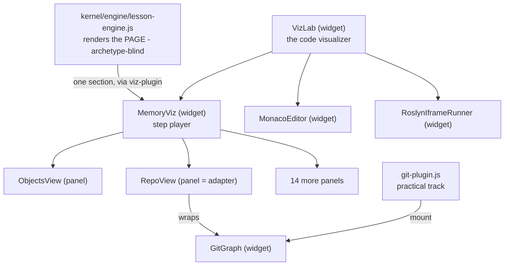

# code-lab composition - widget, panel, scene

What the words mean here, and how the pieces fit. Written because "widget",
"panel", "scene" and "renderer" were used interchangeably, which hid a real
coupling question. Measured 2026-08-07.

## What `code-lab` is

Two things of different kinds in one submodule: the **reusable interactive
pieces** (TypeScript, unit-tested, built by `tsup` into the IIFE bundle vendored
at `vendor/code-lab/code-lab.global.js`), and the **compiler host**
(`compiler-host/`, a Blazor WASM app embedding Roslyn, published to
`level3-app/`, git-ignored and rebuilt by CI).

The course holds no capability. Lessons are data; `code-lab` is what can be done
with it.

## Widget

A top-level `CodeLab.*` export with **its own lifecycle** - `mount(host, opts)`,
`on(event, handler)` if it emits, `destroy()`. You give it a host element and it
takes over. Each owns a `.cl-*` CSS root.

Widgets: `MonacoEditor`, `TextareaEditor`, `ReadOnlyView`, `LineTerminal`,
`GitGraph`, `Quiz`, `Tour`, `IframeRunner` / `RoslynIframeRunner`, `MemoryViz`,
`VizLab`.

## Panel

An implementation of one interface (`src/dom/panel.ts`), and it exists **only
inside `MemoryViz`**:

```ts
export interface Panel {
  readonly el: HTMLElement;        // it HANDS you an element
  sync(ctx: SyncCtx): void;        // called on every step
  animate?(model): Promise<void>;  // optional
  onResize?(model): void;          // optional
}
```

The direction is reversed from a widget. A widget mounts into a host you own; a
panel gives you its `el` and waits to be told the step changed. It has no
lifecycle of its own. There are 17, none exported individually.

## Scene

The per-step DATA a panel renders - `ObjectsScene`, `RepoScene`, `AgentScene`. A
scene is not a component: it is a field on `Step`, resolved by a pure function
(`replayObjects`, `resolveRetrieval`) and handed to the panel.

## How they compose



`RepoView` is the pattern worth copying: a panel that is a thin adapter over a
reusable widget, rather than a bespoke renderer. `VizLab` is the same idea one
level up - pure composition, owning no engine.

## The three extension mechanisms

All three are live in this codebase at once. That is the finding.

| Mechanism | Where | Shape |
|---|---|---|
| Interface + implementations | `EditorAdapter` (`src/types.ts:62`) | 3 impls, optional capability members, chosen by `buildEditor()` |
| Open registry | `Shell<S>` + `src/terminal/commands/` | command sets injected; core never changes |
| Closed map | `panelFactories` (`src/dom/memory-viz.ts:88`) | `Record<PanelType, ...>`; the host imports all 17 views |

The kernel uses an open registry too (`lesson-engine.js:119`, plugins
self-register). `MemoryViz` is the outlier.

## Known deviations (measured, not fixed)

- `memory-viz.ts` statically imports all 17 panel views. Adding a panel edits 4
  shared files; `.github/copilot-instructions.md` documents it as a 7-step
  checklist.
- `Step` (`memory-model.ts:108`) carries 30+ optional fields across three
  unrelated domains. No lesson mixes them - it is a union shaped as a record.
  `Step.refs` means C# heap references; git refs live inside `ObjectsScene`.
- `PanelBuildCtx` (`memory-viz.ts:46`) hands every panel all 12 fields, and the
  `controls` factory assigns `this.controls` - a side effect inside a map of
  constructors.
- 4 `dom -> editors` imports: `viz-lab.ts` (a composer, defensible) and
  `git-file-panel.ts` (a panel embedding an editor).
- `RepoView` has zero lesson consumers. `VizLab` is reachable only from
  `visualize.html`, not from any lesson.
